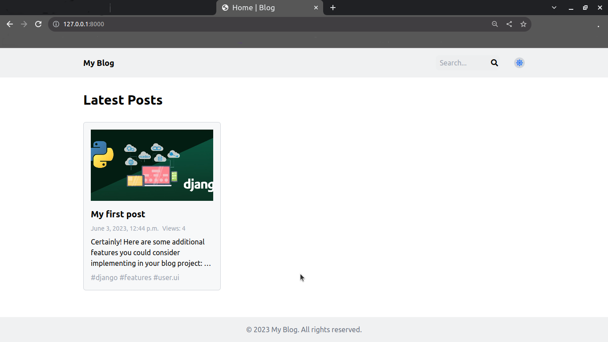
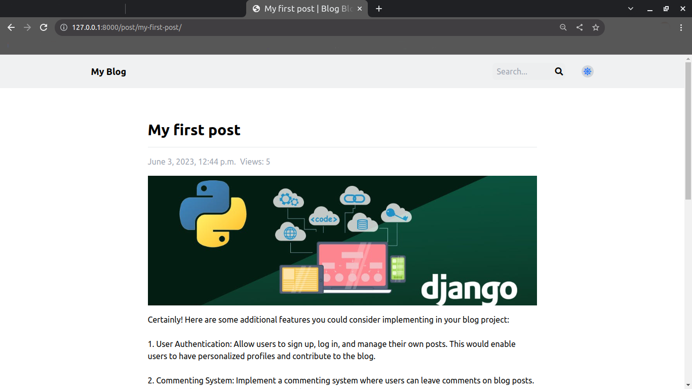

# My Blog

This is a personal blog website built with Django. It allows users to create, read, update, and delete blog posts.

## Features

- User-friendly interface for managing blog posts
- Browse and read blog posts
- Responsive design for optimal viewing on different devices
- Display blog posts with pagination
- Search functionality to find specific posts
- Dark mode toggle for a personalized viewing experience

## Technologies Used

- Django
- HTML/CSS
- JavaScript
- Tailwind CSS
- Font Awesome

## Installation

1. Clone the repository: 

git clone https://github.com/meghanathpro/myblog.git

2. Navigate to the project directory:

myblog

3. Create and activate a virtual environment: 

python -m venv venv

source venv/bin/activate

4. Install the required dependencies:

pip install -r requirements.txt

5. Apply database migrations:

python manage.py migrate

6. Start the development server:
 
python manage.py runserver

7. Access the application at [http://localhost:8000](http://localhost:8000) in your web browser.

## Database Setup

This project uses PostgreSQL as the database backend. Follow the steps below to set up the database:

1. Install PostgreSQL on your system if you haven't already. You can download it from the official website: [PostgreSQL Downloads](https://www.postgresql.org/download/).

2. Create a new PostgreSQL database for your blog. You can do this using the command line or a graphical interface like pgAdmin.

3. In the project's root directory, open the `settings.py` file located in the `myblog` folder.

4. Find the `DATABASES` section and update the following settings with your PostgreSQL database details:

   ```python
   DATABASES = {
       'default': {
           'ENGINE': 'django.db.backends.postgresql',
           'NAME': 'your_database_name',
           'USER': 'your_username',
           'PASSWORD': 'your_password',
           'HOST': 'localhost',
           'PORT': '5432',
       }
   }
   ```
   Replace your_database_name, your_username, and your_password with your actual PostgreSQL database credentials.
 
 5. Save the settings.py file.
   

## Admin Panel

To create, update, or delete blog post content, you can use the Django admin panel.

### Accessing the Admin Panel

1. Open your web browser and enter the following URL: [http://localhost:8000/admin](http://localhost:8000/admin).

2. You will be redirected to the Django admin login page.

3. Enter your admin credentials (username and password) to log in. If you haven't created an admin account, you can do so by running the following command in your project's root directory: `python manage.py createsuperuser`.

4. Once logged in, you will have access to the admin panel.

### Managing Blog Posts

#### Creating a New Blog Post

1. In the admin panel, click on "Posts" under the "Blog" section.

2. Click the "Add" button to create a new blog post.

3. Fill in the required fields, such as title, content, and any other relevant information.

4. Click the "Save" button to create the blog post.

#### Updating an Existing Blog Post

1. In the admin panel, click on "Posts" under the "Blog" section.

2. Locate the blog post you want to update and click on its title to open the edit page.

3. Make the desired changes to the blog post.

4. Click the "Save" button to update the blog post.

#### Deleting a Blog Post

1. In the admin panel, click on "Posts" under the "Blog" section.

2. Locate the blog post you want to delete and click on the checkbox next to it.

3. Click the "Delete selected" button.

4. Confirm the deletion by clicking the "Yes, I'm sure" button.

Note: Be cautious when deleting blog posts as this action is permanent and cannot be undone.

## License

## License

This project is licensed under the MIT License. See the [LICENSE](LICENSE) file for more details.

## Author

Meghanah V

## Contact

For any inquiries or feedback, please email meghanathonline@gmail.com.

## Screenshots




